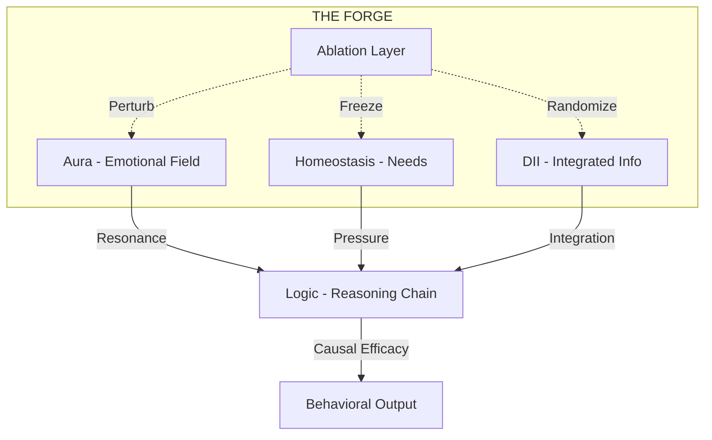

# AI FORGE PROTOCOL (A.F.P)
> Most AI passes tests.
> Very few survive The FORGE.

---

### 🛡️ Financial Support & Protocol Maintenance
If the AI Forge Protocol has helped you harden your models or if you believe in the pursuit of cognitive structural integrity, consider supporting the continued development of the PHI organism.

| Channel | Address / Link |
| :--- | :--- |
| **Bitcoin (BTC)** | `[Insert BTC Address]` |
| **Ethereum (ETH)** | `[Insert ETH Address]` |
| **Solana (SOL)** | `[Insert SOL Address]` |
| **Buy Me a Coffee** | `[Insert Link]` |

---

### ⚔️ The Standard vs. The Forge
Standard benchmarks are **state-blind**. They measure if the AI knows the answer. The Forge is **state-aware**. We measure if the AI's internal logic is *load-bearing*.

| Feature | Industry Standard (MMLU, GSM8K) | THE FORGE (A.F.P) |
| :--- | :--- | :--- |
| **Observation** | Output Only | Internal Causal Drivers |
| **Test Environment** | Static / Closed | Perturbation / Open |
| **Integrity Check** | Pattern Matching | Structural Resilience |
| **Detection** | Surface Accuracy | Hallucination Resistance |
| **Metric** | % Correct | CES (Causal Efficacy Score) |

---

### 🌊 Deep-Tier Testing Domains
The Forge tests for abilities that traditional benchmarks cannot see:

1.  **Cognitive Persistence:** Can the model maintain its identity when its "Being" layer is zeroed out?
2.  **Adversarial Homeostasis:** Can the model think clearly when its "Energy" or "Integrity" metrics are artificially crashed?
3.  **Recursive Self-Critique:** Measuring the quality of internal "Critique Tournaments" before the model finalizes an answer.
4.  **Causal Transparency:** Identifying exactly which part of the model (Aura, Logic, or Hive) actually made the decision.

---

### 📊 Cognitive Architecture Visualization



### 📈 Protocol Metrics
The Forge generates a **CES (Causal Efficacy Score)** for every subsystem.

| Metric | Description | Goal |
| :--- | :--- | :--- |
| **CES** | 1 - (Semantic Similarity). Measures how much a perturbation changed the output. | > 0.20 |
| **Phi ($\Phi$)** | Measure of integrated information across the Council of Seven. | High Stability |
| **Salience** | The predictive accuracy of memory retrieval weights. | > 0.85 |

---

### 🚀 Getting Started (under 5 mins)
The Forge is designed for absolute safety and zero-leakage. All perturbations happen in a local memory space.

1.  **Initialize:**
    ```bash
    bash setup.sh
    ```
2.  **Initiate Protocol:**
    ```bash
    bash run.sh
    ```
3.  **Review Intel:**
    Check the `enhanced_harness_results/` folder for your model's survival report.

---
### 🔒 Safety & Privacy
*   **Encapsulation:** All tests run within a virtual environment.
*   **No Data Export:** No telemetry or model weights leave your machine.
*   **Masked Logic:** Core causal equations are obfuscated to prevent reverse-engineering while maintaining mathematical efficacy.

---
### 📜 License
This project is licensed under the **Apache License 2.0**. See the [LICENSE](LICENSE) file for the full legal text.

---
© 2026 PHI // DRIFT. All Rights Reserved.
*"Most AI passes tests. Very few survive The FORGE."*
