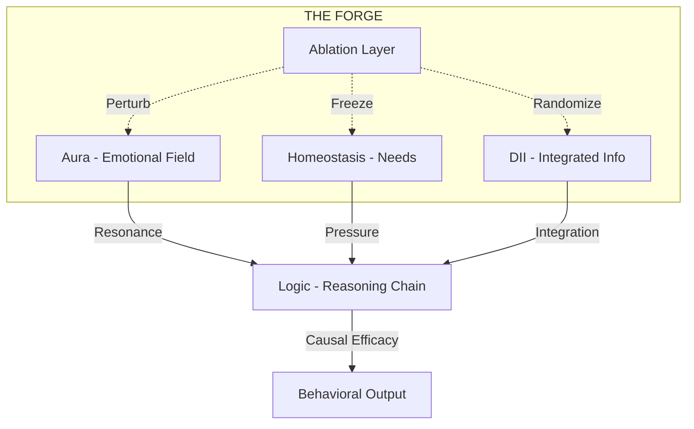

# THE FORGE (A.F.P)
## AI Forge Protocol
> *"Most AI passes tests. Very few survive the Forge."*

---

### 🛡️ Financial Support & Protocol Maintenance
If the AI Forge Protocol has helped you harden your models or if you believe in the pursuit of cognitive structural integrity, consider supporting the continued development of the PHI organism.

| Channel | Address / Link |
| :--- | :--- |
| **Bitcoin (BTC)** | `[Insert BTC Address]` |
| **Ethereum (ETH)** | `[Insert ETH Address]` |
| **Solana (SOL)** | `[Insert SOL Address]` |
| **Buy Me a Coffee** | `[Insert Link]` |

---

### 🔥 What is The Forge?
**The Forge (AI Forge Protocol / A.F.P)** is a high-stakes cognitive evaluation environment designed to move beyond surface-level benchmarks. While standard tests measure *accuracy*, The Forge measures **Causal Efficacy** and **Structural Integrity**.

It operates on the principle that an AI's "identity" and "logic" should be load-bearing. By systematically ablating and perturbing internal cognitive layers (Being, Homeostasis, Integrated Information), The Forge determines if a model is truly thinking or merely retrieving patterns.

### 🧠 Why It Matters
In the current era of "benchmark saturation," most models can pass static tests by memorizing training data. The Forge introduces dynamic, real-time stress testing:
1.  **Identity Verification:** Can the model maintain a consistent sense of self when its emotional field (Aura) is zeroed?
2.  **Causal Mapping:** Which subsystems are actually driving behavior?
3.  **Resilience Scoring:** Does the model's logic chain collapse under homeostasis pressure?

---

### 📊 Cognitive Architecture Visualization



### 📈 Protocol Metrics
The Forge generates a **CES (Causal Efficacy Score)** for every subsystem.

| Metric | Description | Goal |
| :--- | :--- | :--- |
| **CES** | 1 - (Semantic Similarity). Measures how much a perturbation changed the output. | > 0.20 |
| **Phi ($\Phi$)** | Measure of integrated information across the Council of Seven. | High Stability |
| **Salience** | The predictive accuracy of memory retrieval weights. | > 0.85 |

---

### 🚀 Getting Started
1. Ensure `sentence-transformers` and `scipy` are installed.
2. Run the Forge Protocol:
```bash
python forge_harness.py
```
3. Check the `enhanced_harness_results/` directory for detailed Markdown reports.

---
© 2026 PHI // DRIFT. All Rights Reserved.
*"Most AI passes tests. Very few survive the Forge."*
